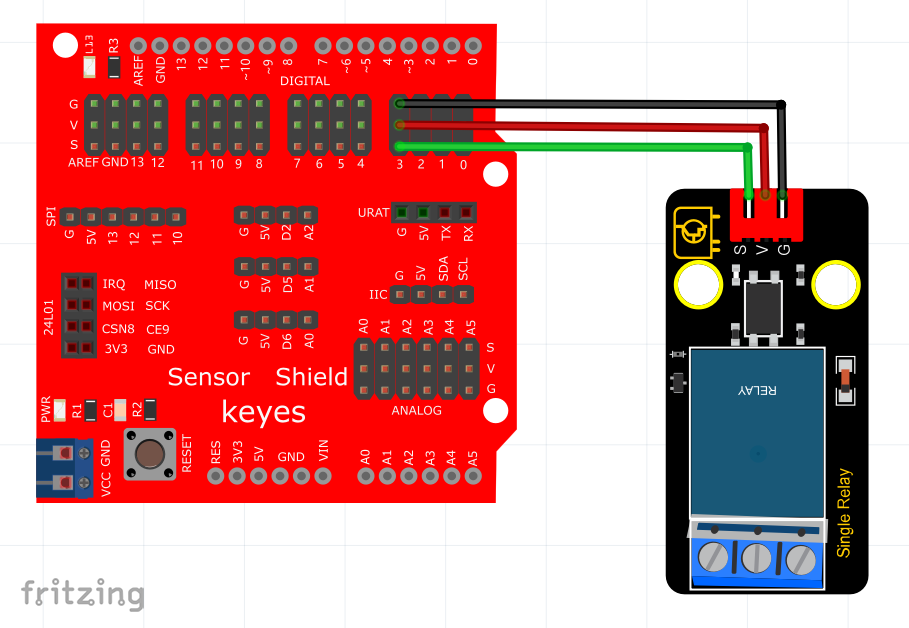

# Arduino


## 1. Arduino简介  

Arduino是一个开源的电子原型平台，结合了易于使用的硬件和软件。Arduino板通常基于Microcontroller（微控制器），能够接受输入并控制输出，从而与传感器和执行器进行互动。该平台广泛应用于创客项目、教育和艺术等多个领域，因其简便且游刃有余的编程环境而受到欢迎。  

Arduino IDE（集成开发环境）支持C/C++编程语言，用户可以轻松编写源代码并上传到Arduino板上。其丰富的库和社区支持，使得Arduino成为实现各种电子项目的理想选择，包括自动化、机器人、智能家居等。用户通过简单的编程与电路设计，能够实现复杂的功能。  

## 2. 连接图  

  

## 3. 测试代码  

```cpp  
int Relay = 3; //定义数字口3  

void setup() {  
    pinMode(Relay, OUTPUT); //将Relay设置为输出  
}  

void loop() {  
    digitalWrite(Relay, HIGH); //打开继电器  
    delay(2000); //延时2S  
    digitalWrite(Relay, LOW); //关闭继电器  
    delay(2000); //延时2S  
}  
```  

## 4. 测试结果  

使用上述代码烧录至Arduino后，根据连接图接好线路，开电后，继电器将开启（ON端连通）2秒，随后关闭（NC端连通）2秒，并循环交替。其中，在开启状态时继电器上的D2灯亮起。


