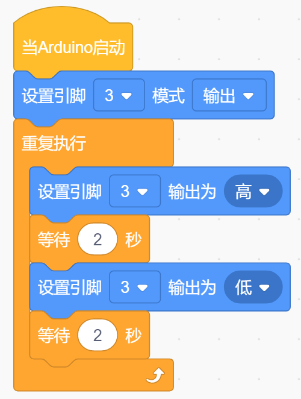

# KidsBlock

## 1. Kidsblock简介  

Kidsblock是一个以图形化编程为基础的学习平台，专为儿童和初学者设计，使他们能够轻松地学习编程和电子技术。该平台通过拖放式的编程模块，允许用户在不需要深入了解复杂编程语法的情况下开展互动项目和实验。Kidsblock与多种硬件兼容，包括Arduino等，促进用户在实践中加深对编程和电子学的理解。  

Users能够使用Kidsblock构建丰富的项目，通过现成的模块轻松实现诸如LED控制、传感器读取和马达控制等功能。该平台提供了大量的教程和支持，是培养动手能力和创造性思维的极佳工具。  

## 2. 连接图  

  

## 3. 测试代码  

  

## 4. 测试结果  

根据连接图连接好线路，并烧录上面的代码后，执行该项目的继电器将高电平有效。在连接好电源后，继电器将依次开启（ON端连通）2秒，停止（NC端连通）2秒，并循环交替。开启状态时，继电器上的D2灯将亮起。

