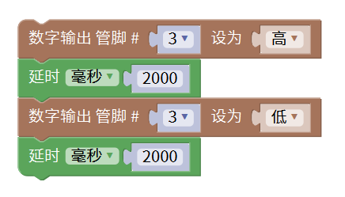

# Mixly

## 1. Mixly简介  

Mixly是一个面向初学者的图形化编程平台，尤其适合儿童及新手设计。与Arduino兼容，Mixly允许用户通过简单的拖放式界面构建程序，提供了一种易于访问的方式来学习编程和电子技术。其设计理念旨在降低编程的复杂性，让用户专注于逻辑和创意，而无需关注语法细节。  

Mixly支持多种硬件模块，用户可以轻松实现各种互动项目，如LED控制、传感器读取和马达驱动。提供丰富的教程和模块，使得学习过程愉快且高效。  

## 2. 连接图  

  

## 3. 测试代码  

  

## 4. 测试结果  

根据连接图连接好线路，并烧录上面的代码后，该项目的继电器将高电平有效。上电后，继电器将开启（ON端连通）2秒，然后停止（NC端连通）2秒，并循环交替。在开启状态时，继电器上的D2灯将亮起。

