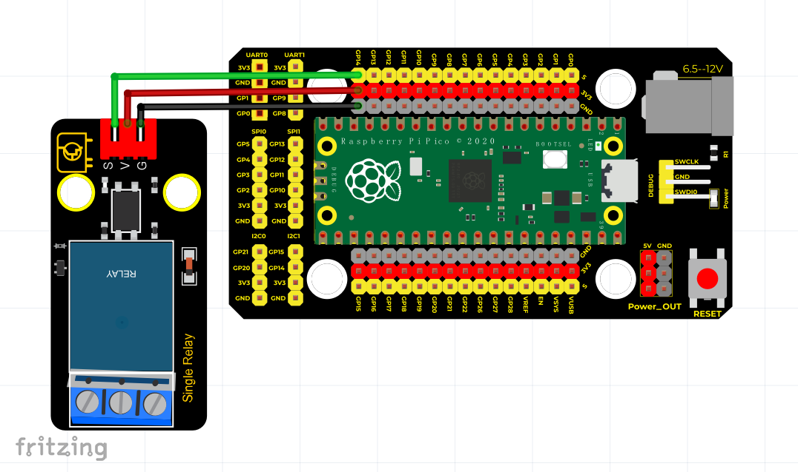

# Python


## 1. Python简介  

Python是一种高级编程语言，因其简洁的语法和强大的功能而受到广泛的欢迎。它支持多种编程范式，包括面向对象编程、过程化编程和函数式编程。Python具有丰富的标准库，适合用于数据分析、机器学习、Web开发、自动化脚本等多个领域。对于初学者来说，Python的易读性和灵活性使其成为学习编程的首选语言。它的社区支持也极其强大，使得用户能够轻松获取文档、教程及解决方案。  

Python还可以与多种硬件平台合作，例如树莓派和Arduino，使其在物联网和电子项目中尤为流行。通过使用Python，用户可以创建从简单到复杂的各种应用，这也促进了其在教育和行业中的广泛应用。  

## 2. 连接图  

  

## 3. 测试代码  

```python  
import machine  
import utime  

external = machine.Pin(14, machine.Pin.OUT)  # 设置引脚14为输出  

while True:  
    external.toggle()  # 引脚14输出高电平  
    utime.sleep(1)  # 暂停1S  
```  

## 4. 测试结果  

根据连接图连接好线路，并烧录上述代码后，开电后，继电器将高电平有效。在此过程中，继电器将依次开启（ON端连通）1秒，然后停止（NC端连通）1秒，并循环交替。在开启状态时，继电器上的D2灯将亮起。


